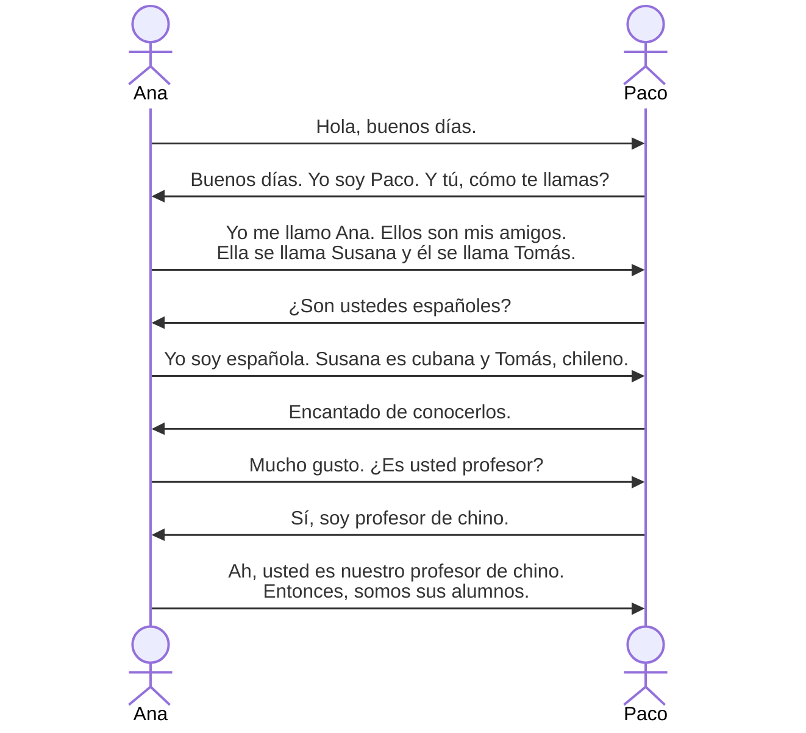
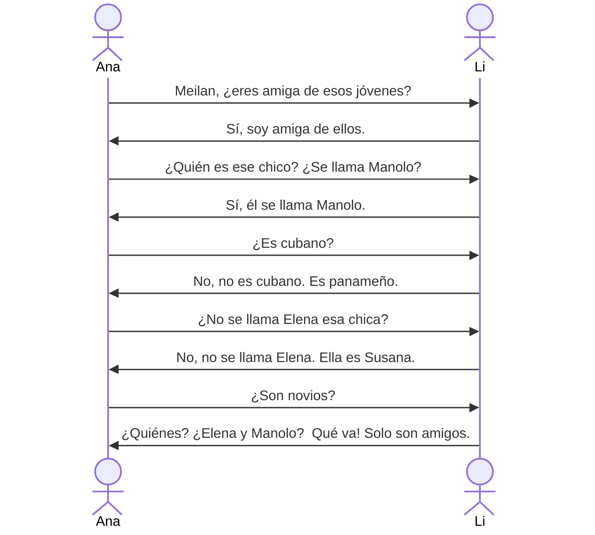

# ¿Cómo te llamas?

## Buenos días.
早上好。

中午好 Buenas tardes，晚上好 Buenas noches

- día m. 天 
- tarde f. 下午
- noche f. 晚上

bueno/na adj.  好
- un libro bueno（一本好书）
- una buena idea（一个好主意）

buneo在**单数阳性**名词**前**，用短尾形式buen
- un buen amigo（一个好朋友）

## ¿Cómo te llamas? 
你叫什么名字？

cómo是疑问词，用于提问方式、原因、状态等

询问方式，相当于英语how
- ¿Cómo se dice "hello" en español? （“hello”用西班牙语怎么说？）
- ¿Cómo te llamas?（你怎样称呼自己？/你叫什么名字？）

询问状态
- ¿Cómo estás?  （你好吗？/你怎么样？）

回答¿Cómo te llamas?
- Me llamo Ana. （我叫Ana。）

**llamarse** *prnl.* 叫......名字

>[!note]
>tr：及物动词
>
>intr：不及物动词
>
>prnl：代词式动词
>
>代词式动词本身就带se，但是要根据人称变位
>
>及物和不及物动词表被动时要加se

| 人称            | llamarse陈述式现在时 | 翻译         |
| ------------- | -------------- | ---------- |
| yo            | me llamo       | 我叫         |
| tú            | te llamas      | 你叫         |
| él/ella/usted | se llama       | 他/她/您叫     |
| nosotros      | nos llamamos   | 我们叫/我们称自己为 |
| vosotros      | os llamáis     | 你们叫/你们自称   |
| ellos         | se llaman      | 他们叫/他们被称为  |

## Encantado de conocerlos. 
很高兴认识你们。

encantado/da是动词encantar的过去分词形式，在这里作为形容词使用，表示“感到高兴的”或“被迷住的”。根据说话人的性别变形
- 男：Encantado de conocerte.
- 女：Encantada de conocerte.

 de是一个介词，用于连接形容词“encantado”和动词“conocer”（认识），构成“de conocerlos”的结构。表示原因或来源，相当于英语的to或of

conocerlos由动词conocer（认识）和代词los（你们/您们）组成。这属于**代词附着**

这句话可以理解为Nice to meet you.
## Mucho gusto. 
很高兴（认识你，您，你们，诸位）/很高兴见到你。

- mucho adj. 很多的、大量的 adv. 非常
- gusto m. 高兴，愉快

直译为：很多的愉快
## entonces
那么

用于承接上文，引出结论或下一步行动（so/then）
- Si ellos están aquí, entonces, ¿quién está en casa?（如果他们在这，那么，谁在家？）
- No tienes dinero. Entonces, ¿cómo vas a viajar?（你没钱。那么，你怎么去旅行？）

表示时间上的”当时“（at that time/back then）
- En 2010 vivía en Madrid. Entonces, no hablaba español bien.（2010年我住在马德里。那时候，我西班牙语还说不好。）
## y
表示连接，相当于英语and，在i或hi开头的词前变成e
- Padre e hijo.（父亲和儿子。）
- Yo y él.（我和他。）
# ¿Quién es el chico?
Ana y Li Meilan son amigas. Ana es mexicana y Li Meilan es china. Las dos son estudiantes.

## quién
疑问代词，用于询问人，意为“谁”

直接询问身份或人名：
- ¿Quién es él/ella?（他是谁/她是谁？）
- ¿Quién está llamando?（谁在打电话？）
## ¿Qué va?
一个固定口语表达，表示惊讶或反驳，可译为”怎么可能！“、”才不是呢！“，比no语气更强烈，相当于英语"What are you talking about?" 或 "No way!"
# 语法
## 普通名词和专有名词
西语中名词分**普通名词**和**专有名词**
- 普通名词：某一类人或事物、某种物质、抽象概念（estudiante， día， gusto）
- 专有名词：指称个别人、团体、地方、机构、事物（Susana， Beijing， China， la Trerra, el Instituto Cervantes）

## 名词的数
西语名词分单复数。指称单一人或事物，用单数名词；指称两个或以上的人或事物，用复数名词。

基本规则：

1. 以元音结尾的名词（-a, -e, -i, -o, -u）变为复数直接加-s
- libro（书） → libros
- casa（房子） → casas
- taxi（出租车） → taxis

2. 以辅音结尾的名词，变为复数加-es
- ciudad（城市） → ciudades
- árbol（树） → árboles
- joven（年轻人） → jóvenes

3. 以-z结尾的名词，变为复数，将-z变为-ces
- lápiz（铅笔） → lápices
- voz（声音） → voces

有些单词在从单数变为复数时，书写会改变：

1. 为了保持原有发音：**lápiz**（铅笔） → lápices
2. 为了保持原有重读音节而去掉重音符号：alemán（德国人）→ alemanes
3. 为了保持原有的重音而添加重音符号：joven（年轻人） → jóvenes
## 名词的性
西语名词有阳性和阴性之分。一般可以根据词尾音素判断词的阴阳性。

基本规则：
1. 以-o结尾的名词多为阳性名词
2. 以-a结尾的名词多为阴性名词

## 主格人称代词
西语中人称代词有**主格**、**宾格**、**与格**、**属格**、**夺格**之分。主格人称代词有第一、二、三人称单复数六种形式，均在句中做主语。

| 单数   | 主格人称代词              |                 |     | 复数   | 主格人称代词                    |                         |
| ---- | ------------------- | --------------- | --- | ---- | ------------------------- | ----------------------- |
| 第一人称 | yo                  | 我               |     | 第一人称 | nosotros nosotras      | 我们（男性） 我们（女性）        |
| 第二人称 | tú                  | 你               |     | 第二人称 | vosotros vosotras      | 你们（男性） 你们（女性）        |
| 第三人称 | él ella usted | 他，它 她，它 您 |     | 第三人称 | ellos ellas ustedes | 他们，它们 她们，它们 诸位/您们 |
1. usted和ustedes是第二人称的礼貌式。在拉丁美洲地区，ustedes已经取代了vosotros和vosotras。
2. tú和él在书写时带有重音符号。
## 系动词ser的陈述式现在时变位

| yo              | soy  |     | nosotros, nosotras    | somos |
| --------------- | ---- | --- | --------------------- | ----- |
| tú              | eres |     | vosotros, vosotras    | sois  |
| él, ella, usted | es   |     | ellos, ellas, ustedes | son   |

另一个常见的系动词式estar

ser和estar都可以翻译成“是”

| **Ser**       | **Estar**    |
| ------------- | ------------ |
| 表达永久、固有的特性    | 表达临时、可变的状态   |

ser
- Soy médico.（我是医生。）
- Ella es española.（她是西班牙人。）
- La mesa es de madera.（桌子是木制的。）
- La silla es blanco.（椅子是白色的。）
- Son las tres.（现在是三点。）
- Hoy es lunes.（今天是星期一。）
- Juan es muy simpático. （胡安非常友善。）
- Él es alto.（他个子高。）
- La fiesta es en mi casa.（派对在我家举行。）

estar
- Está enfermo.（他生病了。）
- Tu pelo está mojado.（你的头发湿了。）
- El libro está en la mesa.（书在桌上。）
- Madrid está en España.（马德里在西班牙。）

同一个句子使用ser或estar会表达不同的意思

| **Ser**                         | **Estar**                      |
| ------------------------------- | ------------------------------ |
| Soy feliz.（我天性乐观。）              | Estoy feliz.（我现在开心。）           |
| _Es aburrido._（他是个无聊的人。）        | Está aburrido.（他现在感到无聊。）       |
| La manzana es verde.（苹果是绿色的品种。） | La manzana está verde.（苹果还没熟。） |

口诀？

**"DOCTOR" 用于 Ser**
- **D**ate（日期）
- **O**ccupation（职业）
- **C**haracteristic（特征）
- **T**ime（时间）
- **O**rigin（起源）
- **R**elation（关系）

**"PLACE" 用于 Estar**
- **P**osition（位置）
- **L**ocation（地点）
- **A**ction（进行时）
- **C**ondition（状态）
- **E**motion（情绪）