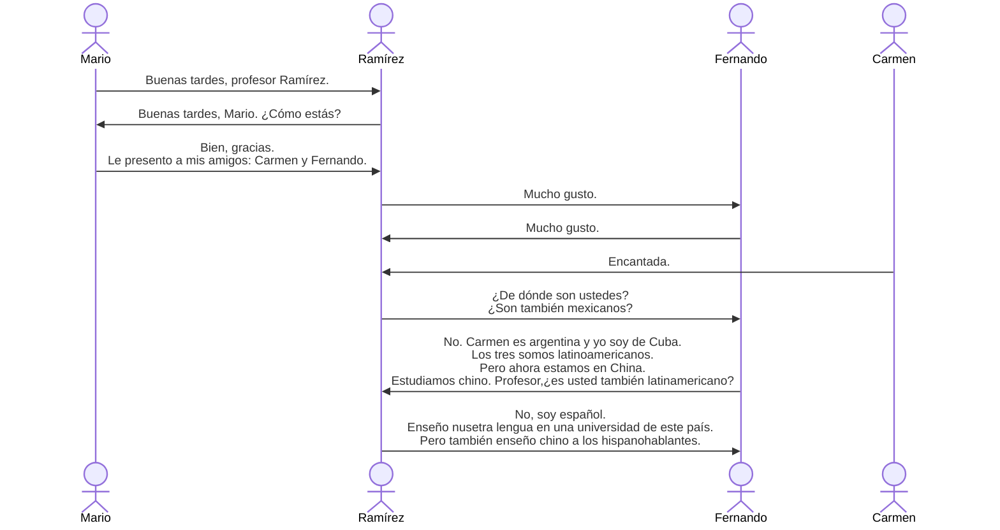

# ¿Cómo estás?
Mario, Carmen y Fernando son tres chicos latinoamericanos. Mario es mexicano, Carmen es agentina y Fernando es de Cuba. Él es el novio de la china. Los tres son estudiantes. Su profesor se llama Carlos Ramírez.

## le presento a
presentar tr. 展现，呈现，介绍

- Le presento a mis amigos: Carmen y Fernando.（我来介绍一下我的朋友：卡门和费尔南多。）

Le是间接宾语代词，意思是 “给/向 他/她/您”，相当于英语的 to him/to her/to you。间接宾语动代词用于替代间接宾语，即替代动作的接收者

这句话完整的翻译为“我向您介绍我的朋友......”，le在这里表示“（我）向您”，“您”是动作的接收者

a 是一个指代人的直接宾语的介词。当直接宾语是人或拟人化的对象时，必须在宾语前加 "a"
- Veo a mi madre. （我看见我妈妈。）
- Busco a un médico. （我找一位医生。）

如果直接宾语是非人，则不加a
- Veo un libro. （我看见一本书。）

## enseñar
tr. 教，授课

- Enseño nusetra lengua en una universidad de este país. （我在这个国家的一所大学里教我们的语言。）

## ¿De dónde son ustedes?
你们是哪里人？/你们来自哪里？

De dónde是疑问词，相当于英语的from where

- De是表示来源的介词（来自）
- Dónde是疑问副词（哪里）

# Ocupados, pero contentos
Victor, pablo y Pilar son latinoamericanos. Yo soy china. Los cuatro somos amigos. Ahora estamos en Alemania. Somos estudiantes. Estudiamos alemán. Tenemos muchas clases todos los días y estamos siempre muy ==ocupados==, pero contentos. ==¿Me preguntas quién es nuestro profesor?== Pues tenemos varios: tres hombres y cuatro mujeres. ==Cada uno se encarga de una asignatura==: lectura, gramática, conversación y muchas otras cosas. ¿Cómo son ellos? Pues todos trabajan mucho. Son muy buenos profesores.

忙碌但快乐

维克多、巴勃罗和皮拉尔是拉丁美洲人。我是中国人。我们四个人是朋友。现在我们在德国。我们是学生。我们学习德语。我们每天有很多课，我们总是很忙碌，但很快乐。你问我我们的老师是谁？我们有好几个老师：三个男老师和四个女孩老师。每个人负责一个科目：阅读、语法、会话和许多其他事情。他们是怎么样？每个人都工作很多。他们是非常好的老师。

## ocupados
adj. 忙碌的（阳性复数）

## ¿Me preguntas quién es nuestro profesor?
你问我谁是我们的老师？

me是间接宾语代词，表示“向我”，这里直译为"你（向我）问......？"，“你向我问"即”你问我“

quién es nuestro profesor是一个间接疑问句

整句话类似于Are you asking me who our teacher is?

间接宾语代词：

| 人称       | 单数          | 复数                            |
| -------- | ----------- | ----------------------------- |
| **第一人称** | me (给我)     | nos (给我们)                     |
| **第二人称** | te (给你)     | os (给你们，西班牙) / les (给你们，拉丁美洲) |
| **第三人称** | le (给他/她/您) | les (给他们/她们/您们)               |

## pues
是一个连接词，在句中起承上启下的作用，可以翻译为“其实”或“是这样的”，相当于英语中的well

## Cada uno se encarga de una asignatura
每个人负责一个科目

整句话是主谓宾结构

- 主语：Cada uno，译为每个人，cada是“每个”，uno是“一个人”，相当于英语each one
- 谓语：se encarga de，表示“负责某事”，相当于英语to take charge of oneself
- 宾语：una asignatura，asignatura是科目

encargarse prnl. 管理，照顾，负责

encargarse是一个自复动词（主语发出的动作作用于自身，即自己对自己做某事，比如洗澡，是“我洗我自己”）

se是自复代词，与自复动词搭配使用

自复代词：

| 人称         | 自复代词             | 英语                     | 中文          |
| ---------- | ---------------- | ---------------------- | ----------- |
| **第一人称单数** | me               | myself                 | 我自己         |
| **第二人称单数** | te               | yourself               | 你自己         |
| **第三人称单数** | se               | himself/herself/itself | 他自己/她自己/它自己 |
| **第一人称复数** | nos              | ourselves              | 我们自己        |
| **第二人称复数** | os（西班牙） / se（拉美） | yourselves             | 你们自己        |
| **第三人称复数** | se               | themselves             | 他们自己        |

| 单词                  | 词性        | 中文           |
| ------------------- | --------- | ------------ |
| hispanohablante     | m.f.      | 以西班牙语为母语的人   |
| latinoamericano, na | adj. -s.  | 拉丁美洲的；拉丁美洲人  |
| ocupato, da         | adj.      | 忙碌的          |
| contento, ta        | adj.      | 高兴的          |
| mucho, cha          | adj.      | 很多的          |
| todo, da            | adj       | 所有的          |
| otro, tra           | adj.      | 其他的          |
| vario, ria          | adj.      | 几个           |
| cada                | adj.      | 每一个          |
| siempre             | adv.      | 总是           |
| también             | adv.      | 同样，也         |
| bien                | adv.      | 好            |
| muy                 | adv.      | 很            |
| preguntar           | tr.       | 提问           |
| presentar           | tr.       | 介绍           |
| tarbajar            | tr. intr. | 工作，劳动        |
| estudiar            | tr. intr. | 学习           |
| encargarse          | prnl.     | 担任，承担（代词式动词） |
| encargar            |           | 负责，担任        |
| pero                | conj.     | 但是           |
| pues                | conj.     | 嗯，是这样        |
| Alemania            |           | 德国           |
| alemán              | m.        | 德语           |
| clase               | f.        | （一节）课        |
| asignatura          | f.        | 课程           |
| lectura             | f.        | 阅读           |
| gramática           | f.        | 语法           |
| conversaciñón       | f.        | 会话，谈话        |
| cosa                | f.        | 事情           |
| universidad         | f.        | 大学           |
| lengua              | f.        | 语言           |

# 数字

| 0    | 1   | 2   | 3    | 4      | 5     | 6    | 7     | 8    | 9     | 10   |
| ---- | --- | --- | ---- | ------ | ----- | ---- | ----- | ---- | ----- | ---- |
| cero | uno | dos | tres | cuatro | cinco | seis | siete | ocho | nueve | diez |

| 11   | 12   | 13    | 14      | 15     | 16        | 17         | 18        | 19         | 20     |
| ---- | ---- | ----- | ------- | ------ | --------- | ---------- | --------- | ---------- | ------ |
| once | doce | trece | catorce | quince | dieciséis | diecisiete | dieciocho | diecinueve | veinte |
# 语法
## 第一变位规则动词陈述式现在时的变位
西班牙语中动词原形都以`-ar`，`-er`或`ir`结尾。动词变位规则有**规则**和**不规则**之分。
以`-ar`结尾的规则变为动词为**第一类变位动词**，变位规则是去掉`-ar`，在词根加上如下人称的词尾：

| 人称                    | 词尾    | 例词：estudiar  |
| --------------------- | ----- | ------------ |
| yo                    | -o    | estudi*o*    |
| tú                    | -as   | estudi*as*   |
| él, ella, usted       | -a    | estudi*a*    |
| nosotros, nosotras    | -amos | estudi*amos* |
| vosotros, vosotras    | -áis  | estudi*áis*  |
| ellos, ellas, ustedes | -an   | estudi*an*   |
## 不规则动词estar和tener的陈述式现在时变位

| 人称                    | estar     | tener     |
| --------------------- | --------- | --------- |
| yo                    | est*oy*   | ten*go*   |
| tú                    | est*ás*   | tien*es*  |
| él, ella, usted       | est*á*    | tien*e*   |
| nosotros, nosotras    | esta*mos* | ten*emos* |
| vosotros, vosotras    | est*áis*  | ten*éis*  |
| ellos, ellas, ustedes | est*án*   | tien*en*  |
## 定冠词
西语中定冠词有单复数和阴阳性之分

|     | 单数  | 复数  |
| --- | --- | --- |
| 阳性  | el  | los |
| 阴性  | la  | las |

定冠词用在**名词**、**数词**或**形容词**之前，并与之保持性、数一致

## 介词de的用法
de表示所属，用来回答¿de quién? ¿de qué?等提问

- Ricardo es el novio de Rosa.（里卡多是罗莎的男朋友。）

de后出现el，缩写为del

- Ella es amiga del profesor González.（她是冈萨雷斯教授的朋友。）

## 介词en的用法
en表示地点，用来回答¿dónde?

- ¿Dónde están ustedes? Ahora estamos en China.