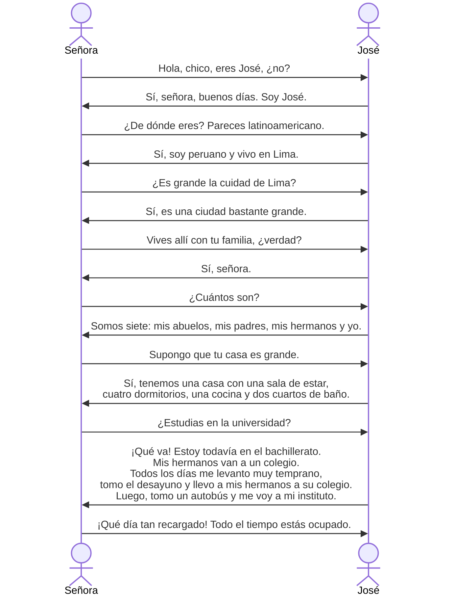

# La casa de Juan
La casa de Juan tiene muchas habitaciones y está en Lima, Perú. Toda su familia vive en ella.

El padre de juan es médico. Trabaja en un hospital. Su madre es profesora. Enseña inglés en un colegio. Juan tiene dos hermanos: una chica y un chico. ==Son menores que él.== Van al colegio. Los abuelos ==ya== muy mayores, no trabajan.

Juan estudia bachillerato (la secundaria). Todos los días se levanta muy temprano. Se baña, se cepilla los dientes y se peina. ==Después== de desayunar, primero lleva a sus hermanos al colegio (la escuela) y ==luego== toma un autobús para ir al instituto (a su centro de estudios).

==Por== la mañana tiene cuatro clases y por la tarde, también cuatro. Todo el día está muy ocupado, ==por== es regresa a casa muy tarde.

胡安的房子

胡安的房子有很多房间，位于秘鲁的利马。他全家都住在里面。 

胡安的父亲是一名医生。他在一家医院工作。他的母亲是一名教师。在学校教英语。胡安有两个兄弟姐妹：一个女孩和一个男孩。他们比他年轻。他们去上学。年纪很大的爷爷奶奶不工作。 

胡安正在读高中（中学阶段）。每天他都起得很早。他洗澡、刷牙、梳头。吃过早饭后，他先送兄弟姐妹去小学（学校），然后乘公交车去高中（他的学习中心）。 

早上有四节课，下午也有四节课。一整天都很忙，所以他很晚才回家。
## Son menores que él.
他们比他年轻。

menor adj. 更小的，更少的，年幼的，未成年的

形容词要和主语保持性数一致，所以变为menores

que是一个比较连接词，相当于英语than

基本比较结构：más/menos/tan + 形容词/副词 + que + 比较对象
- más：更高
- menos：更低
- tan：相等

menor和menos：
- menor是形容词，是形容词 pequeño（小）或 joven（年轻）的比较级形式，用于比较**年龄**、**大小**、**程度**
- menos是副词，用于比较时修饰形容词、副词或动词，表示“更少”或“更低程度”，不可用于比较年龄或大小

## ya
adj. 已经

ya表示动作已经完成时，常用在过去时态的句子中：

- Ya comí. （我已经吃过了。）
- Ya terminé el trabajo. （我已经完成了工作。）

原文中Los abuelos ya muy mayores, no trabajan.是陈述式现在时，强调爷爷奶奶处于一种年纪大的状态，并非“已经完成”

## 学校
- bachillerato 高中
- secundaria 中学，中等教育
- colegio 小学，泛指“学校”
- escuela 学校

## después
adj. 在...之后 + de + 动词原形/名词

- Cepíllate los dientes después de comer.（吃完饭后刷牙。）
- Hablamos después de la reunión.（我们在会议后再谈。）

## luego
adj. 之后，然后

用于连接两个动作：

 - Estudié un rato y luego me fui a dormir.（我学了一会儿，然后去睡觉了。）
 - Primero comí, luego vi una película.（我先吃饭，然后看了电影。）

Primero... luego...（首先...然后...）是一个固定搭配

luego更加口语化，一般指紧接的动作；después更正式，可指更久之后

## por
prep. 表示时间，在......期间

- Por la mañana（在早上）
- Por la tarde（在下午）

conj. 表示因果，连接前后句，因此

- No vine por el mal tiempo. (我没有来是因为天气不好。)
- Lo hizo por amor.(他这样做是为了爱。)

# ¿Cuántos son en tu familia?

## parecer
intr. 好像

- Pareces latinoamericano.（你看起来像拉丁美洲人。）
- Este niño parece muy inteligente.（这个孩子看来很聪明。）

## bastante
adv. 相当；adj. 足够的，相当多的

- El examen fue bastante difícil.（考试相当难。）
- Hay bastante comida en el refrigerador.（冰箱里有很多食物。）

## supongo que...
suopner tr. 设想，猜测

que用于引导从句，Supongo que...类似于I assume that...

## sala de estar
sala f. 房间，大厅

de estar是介词短语，estar表示在某地。sala de estar直译为“用于待着的大厅”，即**客厅**

## todavía
adv. 仍然，还

- Todavía no he visto esa película. (我还没有看那部电影。)

## tomar
tr. 类似英语take，有很多意思

- 吃喝：Voy a tomar un café.（我要喝杯咖啡。）
- 乘坐（交通工具）：Tomamos el autobús para ir al centro.（我们乘公交车去市中心。）
- 拿取：Tomó el libro y empezó a leer.  （他拿起书开始阅读。）
- 采取（措施/决定）：El gobierno tomó medidas contra la contaminación.（政府采取了污染治理措施。）
- 占用（空间/时间）：Esta mesa toma mucho espacio.（这张桌子很占地方。）
- 拍摄（照片）：Tomé una foto del paisaje.（我拍了一张风景照。）
- ......

## tan
adv. 

tan + 形容词/副词，表示程度，多么

- ¡Estoy tan cansado!（我好累啊！）

tan... como... 构成[[Español-Moderno-Unidad-3#Son menores que él.|比较结构]]，和......一样

- Ella es tan inteligente como su hermano.（她和她哥哥一样聪明。）

# 语法
## 形容词的性、数及其与名词的性、数一致关系

1. 形容词有阴阳性变化，与名词的阴阳性保持一致

-o结尾的形容词修饰阳性名词时，词尾不变；修饰阴性名词时，词尾变为-a

| 名词词性 | 形容词词尾 | 例句                                                                           |
| ---- | ----- | ---------------------------------------------------------------------------- |
| 阳性   | o     | Much==o== gust==o==. Tengo un amig==o== peruan==o==.                      |
| 阴性   | o→a   | Vivo ahi tod==a== su famili==a==. Tomás vive en una cas==a== pequeñ==a==. |

-e结尾的形容词没有词尾变化

| 名词词性 | 形容词词尾 | 例句                                                                                   |
| ---- | ----- | ------------------------------------------------------------------------------------ |
| 阳性   | e     | Estudiamos en un institut==o== grand==e==. ¿Es su colegi==o== grande?             |
| 阴性   | e     | Estudia en una universid==ad== grand==e==. Tomás vive en una cas==a== grand==e==. |

2. 形容词与名词保持单复数一致

以元音结尾的形容词在变为复数时，词尾加s

| 复数名词 | 形容词词尾 | 例句                                                                                                                  |
| ---- | ----- | ------------------------------------------------------------------------------------------------------------------- |
| 阳性   | s     | Tod==os== los día==s== Pepe se levanta muy tempeano. Esta casa tiene vari==os== dormitorio==s==.                 |
| 阴性   | s     | Tenemos una casa grande con much==as== habitacione==s==. Le presento a mis amig==as== peruan==as==: Ana y Elena. |

以辅音结尾的形容词变为复数时，词尾加es

| 复数名词 | 形容词词尾 | 例句                                                                                  |
| ---- | ----- | ----------------------------------------------------------------------------------- |
| 阳性   | es    | ¿Tienes un amig==o== ==inglés==? ¿Tienen ustedes amig==os== ==ingleses==?        |
| 阴性   | es    | Nuestra profeso==ra== es muy ==joven==. Nuestras profeso==ras== son ==jóvenes==. |

由系动词ser和estar + 形容词构成的系表结构中，形容词与主语保持单复数和阴阳性一致

- El chic==o== es mexican==o==.
- Los chic==os== son mexican==os==.
- La chic==a== está ocupad==a==, pero content==a==.
- Las chic==as== están ocupad==as==, pero content==as==.
## 非重读物主形容词
物主形容词表示所属关系。西班牙语中有两种物主形容词：
- **非重读物主形容词**
- **重读物主形容词**

| 人称     | 单数形式    | 单数形式    | 复数形式     | 复数形式     | 翻译           |
| ------ | ------- | ------- | -------- | -------- | ------------ |
|        | 阳性      | 阴性      | 阳性       | 阴性       |              |
| 第一人称单数 | mi      | mi      | mis      | mis      | 我的           |
| 第二人称单数 | tu      | tu      | tus      | tus      | 你的           |
| 第三人称单数 | su      | su      | sus      | sus      | 他/她/您/它的     |
|        |         |         |          |          |              |
| 第一人称复数 | nuestro | nuestra | nuestros | nuestras | 我们的          |
| 第二人称复数 | vuestro | vuestra | vuestros | vuestras | 你们的          |
| 第三人称复数 | su      | su      | sus      | sus      | 他们/她们/诸位/它们的 |

用法：

1. 非重读物主形容词放在名词之前，与名词保持数的一致
2. 第一、第二人称的复数形式应与其所修饰的名词保持性的一致

例子：

- ==Mis== padr==es== trabajan en la universidad.（我父母在大学里工作。）
- ==Vuestro== dormito==rio== está ahí.（你们的卧室在那边。）
- ¿Dónde están ==nuestras== habitac==iones==?（我们的房间在哪里？）
- ¿Es ==tu== novi==o== Latinoamericano?（你男朋友是拉丁美洲人吗？）
- ==Sus== amig==os== estudian español.（他/她/您/他们/她们/诸位的朋友在学习西班牙语。）

非重读物主形容词的性、数变化取决于所修饰的名词，与所指代的人无关：

- Mis abuelos son médicos.（“我”可以是男性或女性）
- Su dormitorio es grande.（他/她/您/他们/她们/诸位的卧室很大）
- ¿Dónde está nuestra habitación?（“我们”可以是男性或女性）
- ¿Dónde están nuestras habitaciones?（“我们”可以是男性或女性）

## 不规则动词ir的陈述式现在时变位

| 人称                    | ir    |
| --------------------- | ----- |
| yo                    | voy   |
| tú                    | vas   |
| él, ella, usted       | va    |
| nosotros, nosotras    | vamos |
| vosotros, vosotras    | vais  |
| ellos, ellas, ustedes | van   |

## 介词a的用法之一
表示方向或目的

- Los hermanos de  José van a la universidad.
- ¿Adónde van ustedes?（a与dónde连用时合写位adónde）
- Ahora vamos el hospital.(a与el连用时缩写为al)

## 移行规则
一个单词在行尾没写完时，要拆开写。单词必须按照音节断开，同时在行尾音节前加-；音节较少的单词不拆开，而是整体移到下一行。