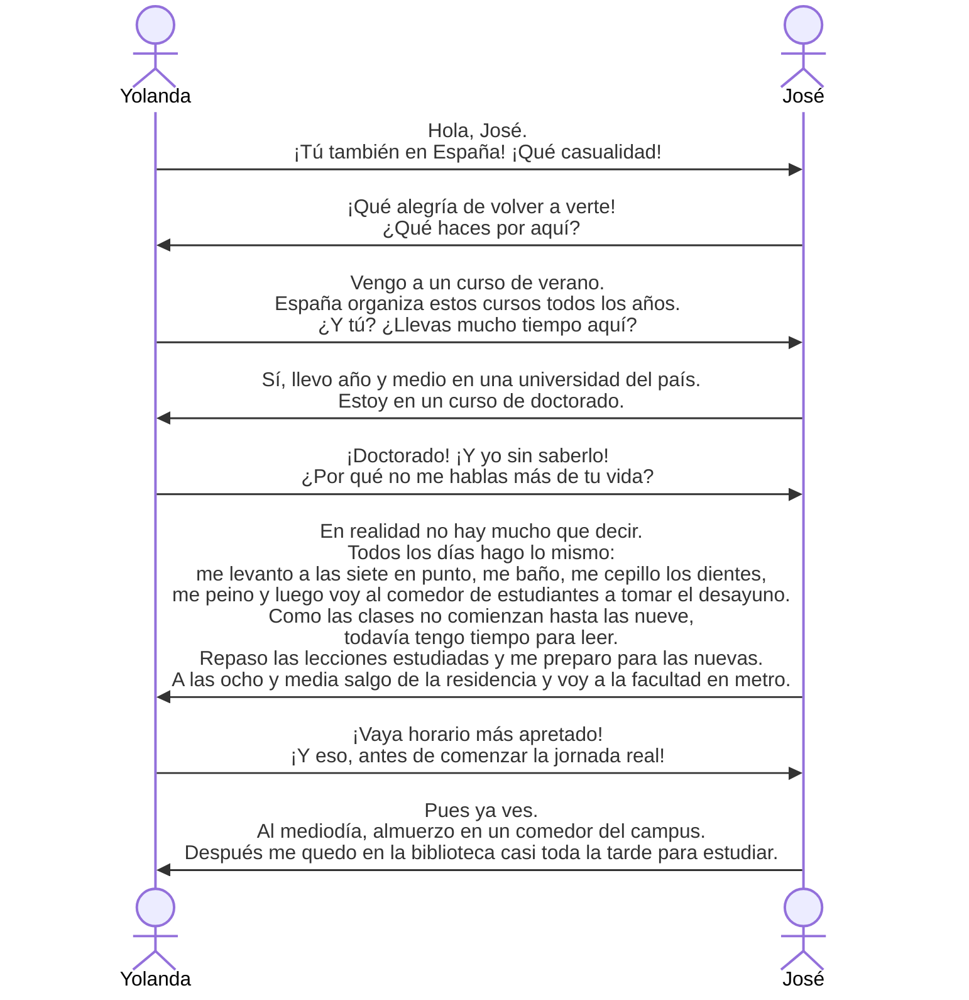

# ¿Por qué no me hablas más de tu vida?

## ¡Qué casualidad!
好巧啊！

casualidad f. 偶然性，巧合

## ¡Qué alegría de volver a verte!
好开心又见到你！

这是一个感叹句，由三部分构成：感叹词（¡Qué!）+ 名词（alegría）+ 补语（de...） 

alegría f. 欢乐，欣喜

volver a + 动词原形：固定搭配，表示“重新做某事”

ver tr. 看见

te pron. 你，第二人称单数宾格、与格形式

整句话可以理解为What a joy to see you again!

## venir
intr. 来 to come

## ¿Llevas mucho tiempo aquí?
你在这里待了很久吗？

llevar + 表示时间的名词 + 地点 ：待在......地方......时间
## yo sin saberlo
我完全不知道

sin prep. 没有

saber tr. 知道

lo/la pron. 您/他/她/它，第三人称单数宾格代词。

lo在此处为中性代词，不指代具体名词，而是指前文提到的事。saber 作为及物动词时必须带宾语，如果省略 lo，句子会不完整

saberlo是一个[[代词附着]]现象，即当代词（如 lo, la, me, te 等）作为动词的直接宾语或间接宾语时，必须附着在动词的不定式、副动词或肯定命令式之后，并连写成一个词

