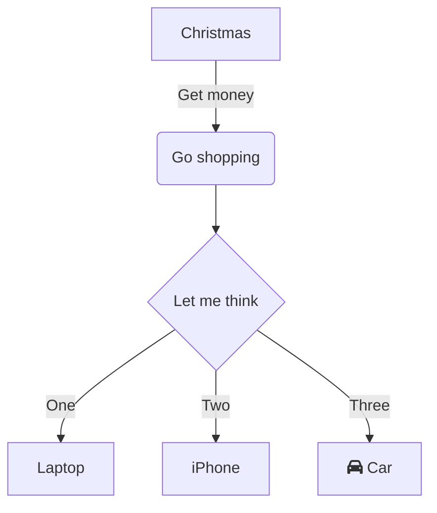

---
这篇文章用来测试本站的Markdown显示情况，同时显示Hugo与Obsidian中Markdown方言的区别。
## 标题

# 一级标题

## 二级标题

### 三级标题

#### 四级标题

##### 五级标题

###### 六级标题

### Admonition

Admonition来自[LoveIt主题](https://hugoloveit.com/zh-cn/theme-documentation-extended-shortcodes/#4-admonition)，需要配合[Shortcode](https://gohugo.io/content-management/shortcodes/)使用，具体可[参考这篇文章](https://lanwp.org/18-hugo-shortcodes-admonition/)，❌Obsidian的引用格式无效


    

    

    

    

    

    

    

    

    

    

    

  

## 文本

仔细看！粗体其实是生效的，但是由于字体的原因，看起来像没加粗

Obdisian的高亮语法无效，需要用html的mark标签

| 文本        | 显示                  |
| --------- | ------------------- |
| 普通文本      | 普通文本                |
| 粗体        | **粗体**              |
| 斜体        | *斜体*                |
| 删除线       | ~~删除线~~             |
| 粗体和斜体     | ***粗体和斜体***         |
| 粗体和删除线    | ~~**粗体和删除线**~~      |
| 斜体和删除线    | ~~*斜体删除线*~~         |
| 粗体，斜体和删除线 | ~~***粗体，斜体和删除线***~~ |
| 下划线       | <u>下划线</u>          |
| 高亮        | ❌==高亮==             |
| 高亮        | <mark>高亮</mark>     |
## 段落

仅用回车无法实现换行，需要在两段文本间添加一个空白行进行换行

  

---

  

无空白行：

文本1
文本2

---

  

有空白行

  

文本1

  

文本2

  

---

## 分割线

使用三个星号或多个`*`,破折号`-`或下划线`_`创建分隔线：

```md

***

---

___

```

  

输出效果（其中下划线破折号和下划线为多个）：

  

***

----

_____

## 代码
### 行内代码
这是一段文本，`这是行内代码`。
### 代码块

```python
print('Hello, World!')
```

## 引用

### 普通引用
>这是一个单行普通引用

>❌这是一个多行普通引用，中间没有空白行
>这是第二行

>这是一个多行普通引用，中间有空白行
>
>这是第二行


## 数学公式

### 行内公式

❌$不生效

$a ^ 2 + b ^ 2 = c ^ 2$

需要使用以下格式

```
\\(a ^ 2 + b ^ 2 = c ^ 2\\)
```

\\(a ^ 2 + b ^ 2 = c ^ 2\\)

### 公式块
用两个$包裹

$$
\begin{aligned} KL(\hat{y} || y) &= \sum_{c=1}^{M}\hat{y}_c \log{\frac{\hat{y}_c}{y_c}} \\ JS(\hat{y} || y) &= \frac{1}{2}(KL(y||\frac{y+\hat{y}}{2}) + KL(\hat{y}||\frac{y+\hat{y}}{2})) \end{aligned}
$$
## 链接

这是一个链接 [Markdown语法](https://markdown.com.cn "最好的markdown教程")。

## 图片


## 表格

|     | 列1  | 列2  | 列3  |
| --- | --- | --- | --- |
| 行1  | a   | b   | c   |
| 行2  | 1   | 2   | 3   |

## 列表
### 有序列表
1. 第一
2. 第二
3. 第三
	1. 第一
	2. 第二
	3. 第三
### 无序列表
- 第一
- 第二
- 第三
	- 第四
		- 第五
			- 第六

## 任务列表

- [x] 完成
- [ ] 未完成

## Mermaid
❌Mermaid无效

{{ < mermaid  align="center"  > }} 
flowchart TD
    A[Christmas] -->|Get money| B(Go shopping)
    B --> C{Let me think}
    C -->|One| D[Laptop]
    C -->|Two| E[iPhone]
    C -->|Three| F[fa:fa-car Car]

{{ < /mermaid > }}



## 嵌入网页

<div style="position: relative; padding: 30% 45%;">
<iframe 
style="position: absolute; width: 100%; height: 100%; left: 0; top: 0;" 
src="https://docs.python.org/zh-cn/3/tutorial/index.html" 
frameborder="1" 
scrolling="yes" 
width="320" 
height="240"
</iframe>
</div>
